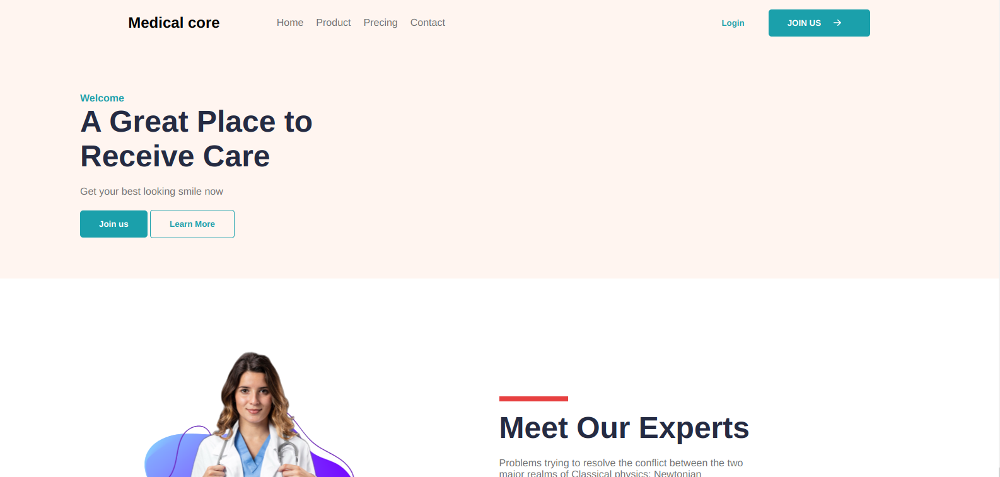

# the-gym medical-core-template-clone

## Welcome! 👋

This is a solution to the Gym Traning. The Gym challenge help us to improve our coding skills by building realistic projects.
we try to implement the design of medical-core, using only HTML and vanilla CSS, structured with the BEM notation. no any JS frameworks like vite, no any CSS frameworks either.

## Content

- [The challenge](#the-challenge)
- [Screenshot](#screenshot)
- [Links](#links)
- [My process](#my-process)
- [Built with](#built-with)
- [Author](#author)
- [Contact Us](#connect-us)

### The challenge

Users should be able to:

- Try to implement the design below, using only HTML and vanilla CSS, structured with the BEM notation,
- Do not use any JS frameworks like vite, do not use any CSS frameworks either,
- When you start the project, immediately create a "development" branch where you will do all your coding,
- When you are finished, create one large pull request (dev > main), which will then be reviewed by the code reviewer of your gym,
- Figma-file like : [ The challenge - figma-file](https://www.figma.com/proto/dIzS9b2LMonp8T4PAAFOOH/Medical-Core-html-website-template-with-source-code-for-medical-Community?node-id=2%3A61&scaling=min-zoom&page-id=2%3A2)

### Screenshot

### Links

- Live Site URL: [Medical-core clone]()

## My process

- HTML
- Vanilla CSS
- Mobile-first workflow
- Structured with the BEM notation

## Author

- Twitter - [@ibrahim_Bagalwa](https://twitter.com/ibrahim_Bagalwa)
- LinkedIn - [ibrahim-bagalwa](https://www.linkedin.com/in/IbrahimBagalwa)

## Connect Us:

   

---

